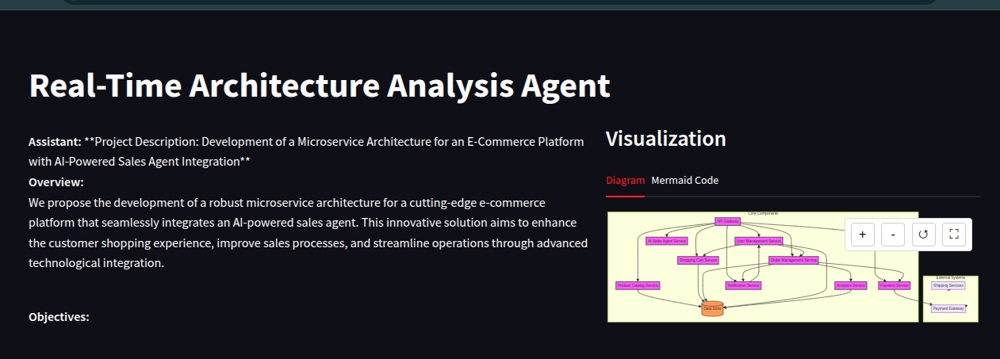

# Agent Dev - Real-Time Architecture Analysis Agent

Agent Dev is an AI-powered system designed to analyze and refine software architecture descriptions in real time. The agent leverages advanced language models, LangChain, and LangGraph to transform user inputs into a refined project description, generate detailed architecture specifications, and create interactive visualizations (via Mermaid diagrams). This project is ideal for developers, architects, or anyone interested in exploring AI-driven design refinement.

## Features

- **Architecture Refinement:** Uses an LLM to improve raw project descriptions.
- **Architecture Generation & Updates:** Generates initial architecture specifications and allows iterative improvements based on user feedback.
- **Visualization:** Automatically produces a Mermaid diagram for architecture visualization.
- **Real-Time Feedback Loop:** Incorporates human review to refine the architecture iteratively.
- **Streamlit Interface:** Provides an interactive UI for input, live updates, and visualization.


## Demo Video

Watch a quick demo video of the agent in action

[](https://www.loom.com/share/b61c9b4d92f14e97895f0d558b95af71?sid=26330413-d691-49f3-a576-86df3788eea8)


## Project Structure

```
arch-analysis/
├── agent.py            # Contains the ArchitectureProcessor class for handling processing and feedback loops.
├── app.py              # Streamlit application for interacting with the agent.
├── helper.py           # Helper functions including rendering of Mermaid diagrams.
├── notebook/
│   └── Arch-gen.ipynb  # Jupyter Notebook with example architecture generation.
├── prompt.py           # Defines prompt templates for various stages of the workflow.
├── README.md           # This file.
├── schema.py           # Contains data schemas (e.g., AgentState, HumanFeedback).
└── workflow.py         # Workflow definition using LangGraph (refinement, architecture generation, human review, and visualization).
```

## Getting Started

### Prerequisites

- Python 3.8+
- Required libraries: `streamlit`, `langchain`, `langgraph`, etc.

Install the required dependencies using pip:

```bash
pip install -r requirements.txt
```

### Installation

1. Clone the repository:

    ```bash
    git clone https://github.com/yourusername/agent-dev.git
    cd agent-dev/arch-analysis
    ```

2. (Optional) Set up a virtual environment:

    ```bash
    python -m venv venv
    source venv/bin/activate  # On Windows use: venv\Scripts\activate
    ```

3. Install dependencies:

    ```bash
    pip install -r requirements.txt
    ```

### Running the Application

Start the Streamlit app by running:

```bash
streamlit run app.py
```

This will launch a browser window where you can enter your system architecture description and interact with the AI agent.

## Workflow Overview

The agent workflow consists of the following stages:

1. **Refine:** Improves the raw architecture description.
2. **Architecture Generation:** Generates the initial architecture specification or updates it based on feedback.
3. **Human Review:** Prompts for human feedback to assess the generated architecture.
4. **Visualization:** Generates Mermaid diagram code for an interactive architecture visualization.

The workflow is defined in `workflow.py` and executed through the `ArchitectureProcessor` in `agent.py`.

